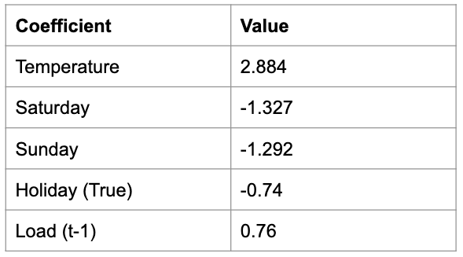

# Peaky-Finders

This peak load forecasting application provides two resources for New York City building owners, facility managers, and residents interested in tomorrow's total electricity grid demand. The first model is a next-day hourly load curve for the NYISO. The second is a confidence interval representing the percent chance that tomorrow will be a peak load event. 

## Tech Stack

- Python 
- Pandas
- Matplotlib
- Scikit-Learn
- Flask
- Dash 
- Plotly

## Data

For data collection, I used the PYISO open-source library to scrape hourly electricity load data from the NYISO website and the DarkSky API to gather hourly weather data. The models were trained on peak load seasons from 2013 through 2018 and tested on the 2019 peak load season. I defined a peak load season as the days between June 15 and September 15. Data was cleaned and categorical variables one-hot encoded. 

Shown below is the distribution of days and the peak load recorded during that day. 

## Features

- Previous day value
- Moving average (previous 24-48 hours) 
- Hour of day (Load curve only)
- Day of week 
- Holiday
- Temperature
- UV Index
- Humidity
- Cloud Cover

## Load Curve 

This model was framed as a supervised learning problem in order to compare the performance of a Regression Tree, Random Forest Regressor, and XG Boost algorithms. XG Boost performed the best with a Root Mean Squared Error (RMSE) of 895.14 Megawatts (MW) for the 2019 peak season. The official NYISO day-ahead forecast published on the website had a RMSE of 901.05 MW for the first two weeks of September 2019.

The most important features were temperature, previous day load and weekend/weekday.  

## Peak Day Confidence Interval 

This logistic regression model classifies whether the next day will be a peak load day or not. It uses a .25 threshold value, rather than the standard .5 in order to be conversative and eliminate false negatives. The model was tuned to only include the most important features, shown in the coefficient table below. 

## Front End App

The front end consists of two applications, one for each model, with a Dash app running within a Flask app. The top of the homepage renders the confidence interval from the logistic regression model. It is programmed to provide the response shown below when the probability of a peak load day is under .05%. Otherwise, it will return the percent chance. 

At the bottom of the homepage, the Flask app renders a Dash app using Plotly to create the load curve. 

## Conclusion

Ongoing testing is needed to compare the performance of this XG Boost model throughout dates that do not fall in the peak season and using weather forecasts, not actual forecast 

- Link to [slideshow](https://docs.google.com/presentation/d/1AdA7OE8VJQxQF6DAVs81xLXPfjvnHUb99oBfRkqpB7M/edit#slide=id.g6bd401033a_0_275) 

## Coming Soon 
- Blog Post 
- Higher accuracy load curve for non-peak season days 
- More nuanced weather inputs
- More ISOs (PJM will be next)
- Customized amount of peak days targeting based on each utility's ICAP tag 
